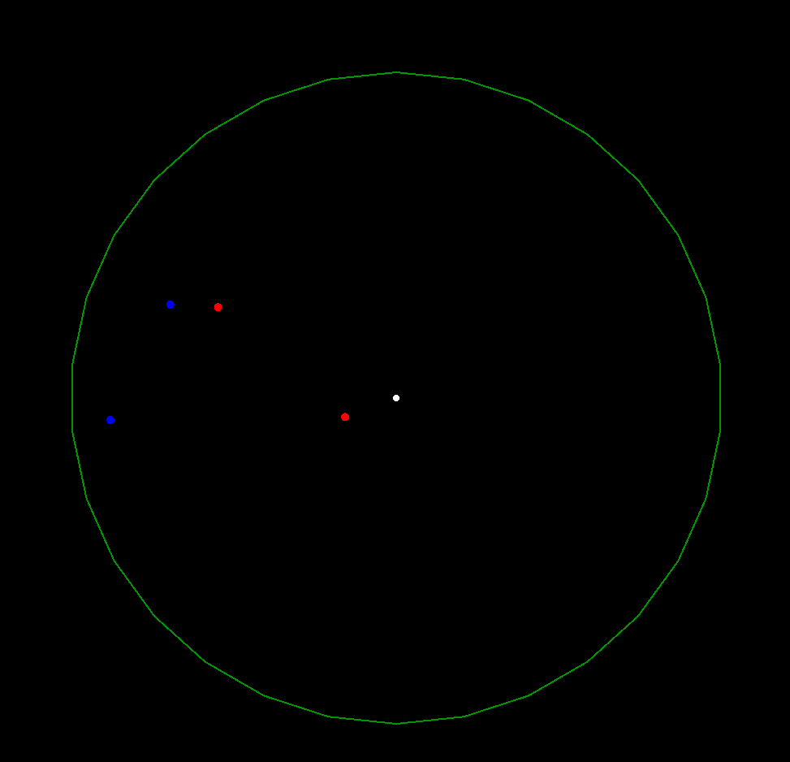

# AirDefender: Interceptor Drone Simulation System

AirDefender is a real-time simulation project written in **C++20**, focused on autonomous interceptor drones defending a protected zone against incoming aerial threats.  
The system combines physics-based guidance, concurrent processing, custom data structures, and live radar visualization.

---

## 📸 Preview



---

##  Features

### Guidance & Flight Control
The interceptor logic is based on real-world inspired pursuit and stabilization methods:

- **Proportional Navigation (PN)** for target interception
- **Adaptive gain scheduling** based on engagement geometry
- **PID controllers** for steering corrections
- **Anti-windup protection** for stable control under saturation

### Real-Time Radar Visualization
Built with **SFML**, the application includes a live tactical radar interface displaying:

- defended base position
- active threats
- interceptor drones
- trajectories
- collision / interception events

### Multi-Threaded Architecture
The simulation uses modern C++ concurrency:

- `std::thread`
- `std::mutex`
- synchronized shared state

Dedicated threads handle:

- simulation / physics loop
- target spawning
- rendering

This keeps the simulation responsive under load.

### Custom Dynamic Container
To optimize frequent entity creation/removal, the project includes a custom `Vector<T>` implementation with:

- contiguous memory layout
- manual resizing
- low overhead access
- **Swap-and-Pop** O(1) deletion

### Procedural Threat Generation
Targets spawn dynamically around a 360° perimeter using random distributions and configurable attack vectors.

### Automated Testing
Core systems are tested using **Google Test**:

- math utilities
- PID controller behavior
- edge cases (`dt = 0`)
- collision logic
- container operations

---

##  Tech Stack

- **Language:** C++20
- **Graphics:** SFML
- **Testing:** Google Test
- **Build System:** CMake

---

##  Build & Run

### Ubuntu / Debian

```bash
sudo apt update
sudo apt install libsfml-dev cmake g++
```
```bash
mkdir build
cd build
cmake ..
make
./AirDefender
```
